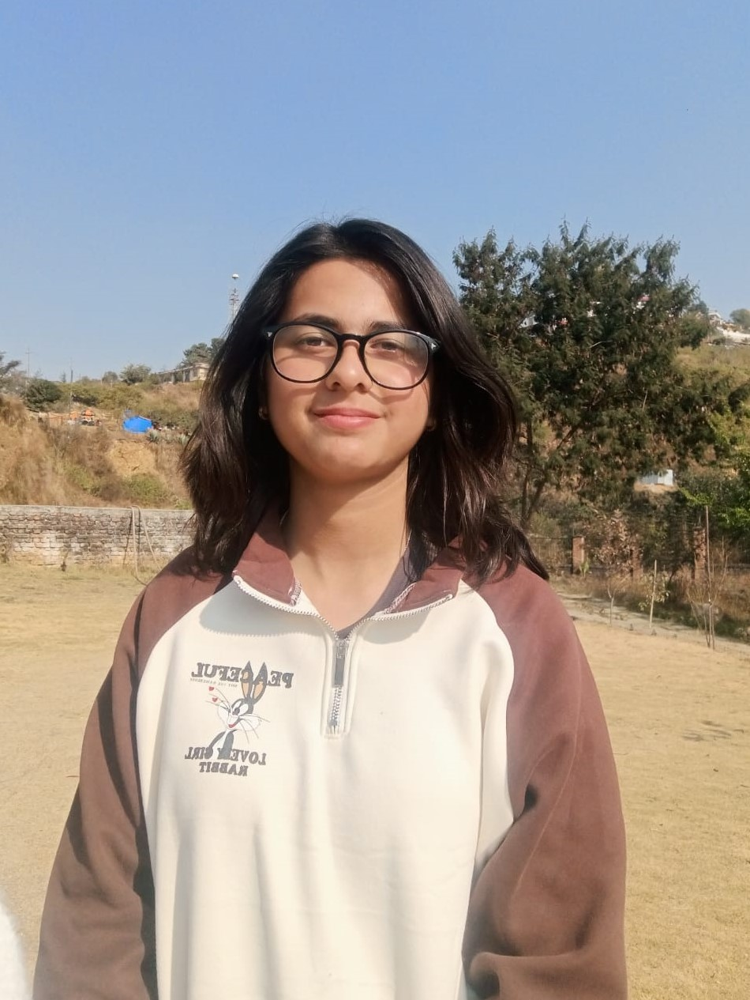
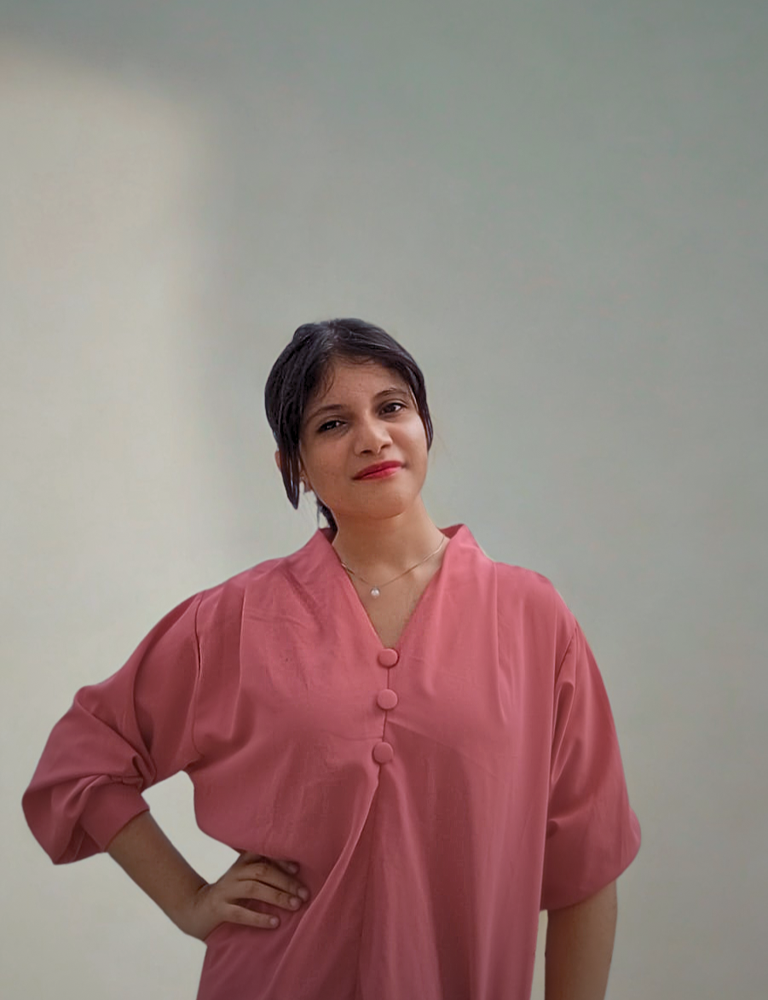

# PlantMD

PlantMD is a web app that identifies crop diseases from leaf photos—tackling up to 30% yield loss through early detection that saves crops, reduces pesticide misuse, and protects incomes.

## Contributors

The contributors of this project are participants of Incubate Nepal 2025 Cohort.

### Mentor

#### Abhishek Dev

<table>
    <tr>
        <td width=150>
            
        </td>
        <td>
            Abhishek is a startup founder at the intersection of crypto and market design. Prior to this, he advised and built with multiple early-stage Web3 startups in ReFi, IP tokenization, and DEXes, applying his research in mechanism design and token economics.Abhishek was a doctoral student in Finance at Yale School of Management, where his work focused on entrepreneurial finance, market design, and decentralized systems. He also supported projects through Venture Incubation Program at Harvard Innovation Labs. Earlier, he conducted research at both Harvard Business School and MIT Sloan, exploring how startup ecosystems and financial markets evolve.
        </td>
    </tr>
</table>

### Peer Mentor

#### Aanchal Nancy Jha

<table>
    <tr>
        <td width=150>
            
        </td>
        <td>
            Aanchal Nancy Jha(Nancy) is an incoming freshman at Carnegie Mellon University in Qatar. She's currently working as a full time programmer. She enjoys learning new programming languages, frameworks, and technologies. Her hobbies include solving puzzles, creating mini-games and side projects, making coding tutorials on YouTube, reading tech blogs, and competing in hackathons. She loves exploring new hobies and she is always eager to learn and take on new challenges.
        </td>
    </tr>
</table>

### Mentees

#### Safal Poudel

<table>
    <tr>
        <td width=150>
            
        </td>
        <td>
            Safal is a web developer from Butwal, Nepal, a recent high school graduate. He works as a freelance web developer, building websites using WordPress and Next.js. Passionate about electronics and innovation, he enjoys working with microcontrollers and sensors to build IoT systems. In his free time, he learns GeoGuessr. He loves exploring new technologies, experimenting with hardware projects, and expanding his knowledge in both software and hardware development.
        </td>
    </tr>
</table>

#### Suyog Prasai

<table>
    <tr>
        <td width=150>
            
        </td>
        <td>
           Suyog Prasai (Suyog) is a passionate programmer and tech enthusiast based in Nepal. He is currently building real-world software projects that bridge the gap between hardware and code — from car automation systems to web-based platforms. Suyog enjoys exploring new technologies, optimizing systems, and experimenting with innovative solutions. In his free time, he likes learning about AI, solving programming challenges, and improving his development workflow. Whether it's debugging code or diving into new frameworks, he's always excited to grow, build, and take on new challenges.
        </td>
    </tr>
</table>
#### Bisika Pant

<table>
    <tr>
        <td width=150>
            
        </td>
        <td>
           Bisika is a high school graduate from KMC, Bagbazar and an aspiring Data Scientist with a strong passion for AI, machine learning, and problem-solving through code. She is a bronze medalist at the National AI Olympiad. A self-driven learner, Bisika thrives on challenges and believes in the power of self-education. Outside of tech, she enjoys digital painting, reading about innovation. She is always eager to explore new ideas, build meaningful projects, and grow as a creator and changemaker.
        </td>
    </tr>
</table>

